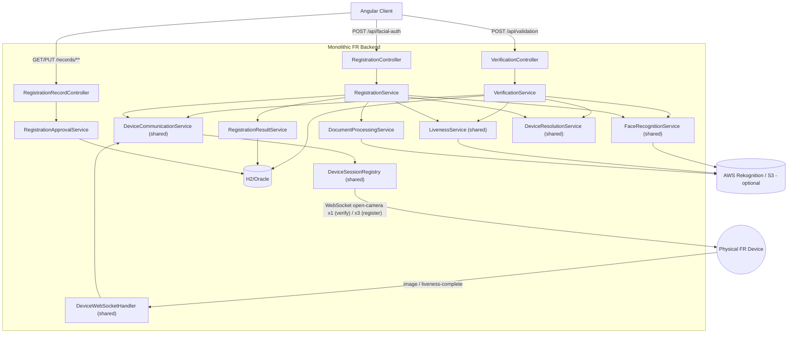

# Registration Path — Implementation Progress

This document tracks the Registration Path implementation added on top of the existing
Verification Path in this monolith. See also `IMPLEMENTATION_PROGRESS.md` (verification) and the
two architecture references: `VERIFICATION_PATH_ARCHITECTURE.md` and
`REGISTRATION_PATH_MONOLITH_ARCHITECTURE.md`.

## 1. Objective

Add the FR **registration/enrollment** path (`POST /api/facial-auth`) into the same monolithic
Spring Boot backend that already implements the verification path, reusing shared infrastructure
(device WebSocket layer, AWS Rekognition wrappers, device/enrollment DB access) rather than
duplicating it, per `REGISTRATION_PATH_MONOLITH_ARCHITECTURE.md`.

## 2. Source projects analysed

- `REGISTRATION_PATH_MONOLITH_ARCHITECTURE.md` (primary reference for this phase).
- `cf-fr-server/Device_Management` — `services/ListenerService.handleRegistration` (3-capture +
  NIC-retry orchestration), `ws/CaptureBroker`, `ws/DeviceSessionRegistry`,
  `security/WebSocketConfig` (all shared with verification, already ported).
- `cf-fr-server/Face_Recognition` — `service/ListenerService.handleFaceRegistration` (4-way
  compare + S3 gate), `utils/NICValidationUtils.containsNationalIdentityCard` (OCR), `service/CardDetectorService`
  (ONNX card-region detector — **not ported**, see Blockers), `service/LivenessService` (shared),
  `service/FaceRecognitionService.compareFacesInMemory`.
- `cf-fr-server/Transaction` — `models/Registration_Record.java`, `models/RegistrationImages.java`,
  `services/DatabaseListenerService.handleCreateRegistrationRecord` (CIF dedup),
  `services/DatabaseWriteService.handleUpdateMultipleImage`/`handleUpdateRegistrationResult`,
  `services/impl/RegistrationManagementRecordImpl.changeStatus` (manual approval).
- `cf-fr-server/Api-Gateway` — `controller/GatewayController.forwardFaceRecognition` (multipart
  request shape), `controller/RegistrationRecordController` (`GET/PUT /records/**`).
- `cf-fr-app` — `roster-information.component.ts`/`roster-information-form.component.ts`
  (confirmed the exact `FacialAuthResponse` field names the frontend already parses).
- The existing monolith's verification implementation (all of `lk.cf.fr.monolith.*`) — reused/refactored
  rather than duplicated wherever the architecture doc recommended it (§18 there).

## 3. Registration flow understanding

End-to-end, as implemented (mirrors `REGISTRATION_PATH_MONOLITH_ARCHITECTURE.md` §11/§24, minus
every Kafka hop, and the deliberate simplifications noted in §12 below):

1. Client `POST /api/facial-auth` (multipart: `data` JSON part + optional `scannedNIC` file part).
2. `RegistrationController` parses the request, calls `RegistrationService.startRegistration(...)`.
3. `RegistrationService`:
   - Validates required fields (`nic`, `userId`, `branchId`, `deviceNickname`, `cifNo`).
   - Resolves an ACTIVE device via `DeviceResolutionService` (shared with verification).
   - CIF dedup via `RegistrationResultService.createOrSupersede`: deactivates any existing active
     record for the same `cifNo`, reclassifies `actionType` to `UPDATE` if one already exists,
     creates the new `registration_record` row.
   - Creates an AWS Rekognition liveness session, notifies the device.
   - Requests the **NIC photo capture**, runs OCR (`DocumentProcessingService.validateNic`), and
     retries the capture up to `registration.nic-max-retries` times if invalid/unknown before
     giving up with a `DOCUMENT_INVALID` error.
   - Requests the **face capture**, then the **self-with-NIC capture** (sequentially, same device
     WebSocket session).
   - Persists the three captured images (as local placeholder refs — see §12).
   - Awaits the device's liveness-completion signal, fetches the liveness verdict.
   - Runs **four pairwise face comparisons** (device-NIC-vs-face, device-NIC-vs-self,
     face-vs-self, and — only if a `scannedNIC` file was uploaded — scanned-NIC-vs-face).
   - Gates on comparisons 2/3/(4 if present) — comparison 1 is informational only, matching legacy.
   - Persists the final result and returns a `RegistrationResponse`.
4. **Unlike verification**, a comparison/liveness mismatch does **not** produce a non-2xx response
   — it's just `false`/`PENDING` data in a normal `200`. Only genuine failures (device
   unavailable/busy, camera error, NIC invalid after retries, timeout, unexpected exception) are
   errors. This exactly mirrors the legacy `GatewayController.forwardFaceRecognition`'s own
   behavior — see §12 below and `REGISTRATION_PATH_MONOLITH_ARCHITECTURE.md` §3.5 point 2.
5. A **separate, later** request — `PUT /records/{referenceId}/{status}` — lets an operator move
   a record to `APPROVED` (`RegistrationApprovalService.changeStatus`), matching the legacy's
   distinct manual-approval step.

## 4. Implemented classes

| File | Purpose | Source reference | Monolith-specific changes |
|---|---|---|---|
| `device/DeviceCommunicationException.java` | Path-agnostic device error (unavailable/busy) | New | Extracted so `DeviceCommunicationService` doesn't depend on either path's exception type |
| `device/DeviceCommunicationService.java` | **Refactored** (was verification-only) — builds/sends `open-camera`, resolves capture/liveness futures | `Device_Management/ws/CaptureBroker.java` | Now keyed purely by `referenceId` (no session object dependency) so it's shared by both paths unchanged — see §5 |
| `recognition/FaceRecognitionService.java` (+Real/+Mock) | **Extended** with `compareFacesInMemory` (bytes-vs-bytes) | `Face_Recognition/service/FaceRecognitionService.compareFacesInMemory` | New method added to existing shared interface |
| `document/NicValidationOutcome.java` | VALID/INVALID/UNKNOWN enum | `NICValidationUtils`'s string return values | New |
| `document/DocumentProcessingService.java` | NIC/document OCR interface | `NICValidationUtils.containsNationalIdentityCard` | Interface, no ONNX card-crop step (see Blockers) |
| `document/RekognitionDocumentProcessingService.java` | Real impl — AWS `DetectText` + ported regex/keyword classification | Same, ported almost verbatim | Runs on the full image, not an ONNX-cropped card region |
| `document/MockDocumentProcessingService.java` | MVP mock — configurable/overridable VALID/INVALID | New | — |
| `persistence/entity/RegistrationRecord.java` | **Extended** with match/similarity ×4, liveness, validNicStatus, image refs, actionDate | `Transaction/models/Registration_Record.java` | Images as plain string refs, not a separate join entity (see §12) |
| `persistence/repository/RegistrationRecordRepository.java` | **Extended** with `findByCifNoAndActiveStatus`, `findByCifNoAndActionType`, `findByReferenceId`, `findByNicOrderByReqTimeDesc` | `Transaction/repository/RegistrationRecordRepository.java` | Only the direct-column queries needed for the MVP |
| `registration/model/RegistrationState.java` | State machine enum | `REGISTRATION_PATH_MONOLITH_ARCHITECTURE.md` §15 | — |
| `registration/model/RegistrationException.java` | Genuine-failure exception, carries a `RegistrationResponse` | New (mirrors `VerificationException`) | — |
| `registration/model/RegistrationSession.java` | In-memory session | Replaces 2× `SharedFlowState` + `Aggregate` | — |
| `registration/dto/RegistrationRequest.java` | Request DTO (+ MVP mock-override fields) | `data` object in `GatewayController.forwardFaceRecognition` | — |
| `registration/dto/RegistrationResponse.java` | Response DTO, matches `FacialAuthResponse`'s Angular fields exactly | `Api-Gateway/Dto/GatewayResponse.java` | — |
| `registration/service/RegistrationResultService.java` | CIF dedup/create, image/result persistence, rollback | `Transaction/services/DatabaseListenerService` + `DatabaseWriteService` | Direct calls, `@Transactional` |
| `registration/service/RegistrationApprovalService.java` | `changeStatus` (manual approval) | `Transaction/services/impl/RegistrationManagementRecordImpl.changeStatus` | Final S3 save replaced with a logged no-op (see §12) |
| `registration/service/RegistrationService.java` | Orchestrator | `Transaction.handleRegistration` + `Device_Management.handleRegistration` + `Face_Recognition.handleFaceRegistration` | See §3 above |
| `controller/RegistrationController.java` | `POST /api/facial-auth` | `GatewayController.forwardFaceRecognition` | — |
| `controller/RegistrationRecordController.java` | `GET /records/{nic}`, `PUT /records/{referenceId}/{status}` | `Api-Gateway/controller/RegistrationRecordController.java` | Returns JPA entities directly (no separate view DTO — admin/demo endpoints) |
| `controller/GlobalExceptionHandler.java` | **Extended** with `RegistrationException` handler | — | — |
| `verification/model/VerificationSession.java` | **Simplified** — removed now-unused `imageFuture`/`livenessCompleteFuture` fields | — | Futures now live in `DeviceCommunicationService`, keyed by `referenceId` |
| `verification/service/VerificationService.java` | **Updated** call sites for the refactored `DeviceCommunicationService` API | — | No behavioral change — same tests pass (see §10) |
| `config/AwsClientsConfig.java`, `recognition/Rekognition*Service.java`, `liveness/Rekognition*Service.java`, `recognition/Mock*Service.java`, `liveness/Mock*Service.java` | **Renamed** conditional property `verification.aws.enabled` → `aws.enabled` | — | One shared flag now gates AWS for both paths |

## 5. API Endpoints

### Start registration
```
POST /api/facial-auth
Content-Type: multipart/form-data
```
Parts:
- `data` (required) — JSON: `{ "cifNo", "nic", "userId", "branchId", "deviceNickname", "prefLang", "oldNic"?, "mockNicValid"?, "mockSimilarity"?, "mockLivenessPassed"? }`
- `scannedNIC` (optional) — image file.

Response (200 on any completed run, including mismatches — see §3):
```json
{
  "referenceId": "...", "status": true, "overallSimilarityDecision": "success|unsuccess",
  "deviceNicVsFaceMatch": true, "deviceNicVsFaceSimilarityScore": 92.0,
  "deviceNicVsSelfNicMatch": true, "deviceNicVsSelfNicSimilarityScore": 92.0,
  "faceVsSelfFaceMatch": true, "faceVsSelfFaceSimilarityScore": 92.0,
  "scannedNicVsFaceMatch": null, "scannedNicVsFaceSimilarityScore": null,
  "livenessPassed": true, "livenessScore": 90.0, "livenessSessionId": "...",
  "validNicStatus": "VALID", "message": "Registration completed.", "reason": null
}
```
Non-2xx (device unavailable/busy, camera error, NIC invalid after retries, timeout, unexpected
error) returns the same shape with `status:false` and `reason` set; HTTP status per
`GlobalExceptionHandler` (400 for business/device errors, 504 timeout, 500 processing error).

### Registration records (read + approval)
```
GET /records/{nic}                         -> List<RegistrationRecord>, newest first
PUT /records/{referenceId}/{status}        -> RegistrationRecord (status set, actionDate stamped)
```

### Not ported (see Blockers)
- `GET /records/getWithdrawalImage/{referenceId}` — depends entirely on the external
  file-storage service this MVP does not integrate.
- `POST /api/registerFaceImages` — architecture doc itself flags this as unclear/possibly
  vestigial (§30 Q3 there); deferred.

## 6. WebSocket Flow

Reuses the verification path's WebSocket infrastructure unchanged (`/device/ws-endpoint`, same
handshake headers, same handler). What's registration-specific is the **sequence of three
`open-camera` commands** the orchestrator issues, differentiated by `tag`:

1. `{"command":"open-camera","data":{...,"flow":"registration","tag":"nicImage"}}` → device
   replies `{"type":"image",...,"tag":"nicImage","content":"<base64>"}` → OCR validated → retried
   up to `registration.nic-max-retries` times if invalid.
2. `{"command":"open-camera","data":{...,"tag":"faceImage"}}` → device replies with `tag:"faceImage"`.
3. `{"command":"open-camera","data":{...,"tag":"selfImage"}}` → device replies with `tag:"selfImage"`.
4. At some point (the mock fires it ~300ms after `liveness-session-created`, matching how a real
   device would report after finishing AWS's own on-device Face Liveness UI): device sends
   `{"type":"liveness-complete","data":{"referenceId":...,"sessionId":...}}`.

Same dedup/timestamp-skew/busy-slot mechanics as verification — see `IMPLEMENTATION_PROGRESS.md`
§7 for the full protocol reference (unchanged here).

## 7. Database Dependencies

| Table | Required? | Notes |
|---|---|---|
| `registration_record` | **Yes** | Extended in this phase — see §4. Single-table design (no separate `registration_images` join table — see §12). |
| `device_records` | Yes (shared) | Unchanged from verification. |
| Stored procedures | None | Legacy has none either — all logic is application-level. |
| External file-storage HTTP service | **Not integrated** | See Blockers — image refs are local placeholder strings. |
| AWS S3 | **Not integrated** | Both the "interim" (comparison-gated) and "final" (post-approval) S3 saves are logged no-ops. |
| AWS Rekognition (`DetectText`, `CompareFaces`, Face Liveness) | Optional, real path exists | Behind `aws.enabled` (default `false`); Mock*Service beans active by default. |
| ONNX card-region model | **Not ported** | See Blockers. |

## 8. Shared Components (reused from Verification, not duplicated)

- `device/DeviceSessionRegistry.java` — unchanged.
- `device/DeviceWebSocketHandler.java`, `config/DeviceWebSocketConfig.java`, `device/TlsConnectionLogger.java`, `config/DeviceWebSocketTuningConfig.java` — unchanged.
- `device/DeviceCommunicationService.java` — **refactored** (see §4/§9) to be usable by both paths; verification's call sites updated accordingly.
- `registry/DeviceResolutionService.java`, `registry/entity/DeviceRecord.java`, `registry/repository/DeviceRecordRepository.java` — unchanged, reused as-is.
- `recognition/FaceRecognitionService.java` (+Real/+Mock) — extended with one new method, otherwise unchanged.
- `liveness/LivenessService.java` (+Real/+Mock) — completely unchanged, reused as-is.
- `verification/model/ComparisonResult.java`, `LivenessOutcome.java`, `LivenessSession.java` — reused directly from the `verification.model` package rather than duplicated. **Known minor inconsistency**: these are genuinely path-agnostic types that architecturally belong in `recognition`/`liveness`, not `verification.model` — not relocated in this pass to avoid any risk of destabilizing the working verification path for a purely cosmetic change. Flagged for a future low-risk cleanup.
- `config/AwsClientsConfig.java` — unchanged except the property rename (§4).
- `controller/GlobalExceptionHandler.java` — extended with one new handler method, existing verification handler untouched.

## 9. Architecture Diagram



## 10. Current Progress

- [x] Analysed `REGISTRATION_PATH_MONOLITH_ARCHITECTURE.md` and the relevant legacy source.
- [x] Refactored `DeviceCommunicationService` to be session-agnostic/shared; verified verification path still passes its full manual test matrix after the refactor.
- [x] Extended `FaceRecognitionService` with `compareFacesInMemory` (Real + Mock).
- [x] Implemented `DocumentProcessingService` (Real + Mock) for NIC/document OCR.
- [x] Extended `RegistrationRecord` entity/repository for the full result set.
- [x] Implemented `RegistrationSession`/`RegistrationState`/`RegistrationException`/DTOs.
- [x] Implemented `RegistrationService` (device request, CIF dedup, 3-capture + NIC-retry orchestration, 4-way compare, persistence).
- [x] Implemented `RegistrationResultService`, `RegistrationApprovalService`.
- [x] Implemented `RegistrationController` (`/api/facial-auth`) and `RegistrationRecordController` (`/records/**`).
- [x] Extended `GlobalExceptionHandler` for `RegistrationException`.
- [x] Full project builds cleanly (`mvnw package`), zero compilation errors.
- [x] Verification path regression-tested on a fresh build — still returns identical results.
- [x] Registration path tested end-to-end via a WebSocket device simulator: success (with and without `scannedNIC`), forced face-mismatch (`mockSimilarity`), NIC-document-invalid with retry-exhaustion (`mockNicValid`), CIF re-registration/supersession, `GET /records/{nic}`, `PUT /records/{referenceId}/APPROVED`.
- [ ] Physical-device test of the registration flow (not yet done — same open item as verification's `IMPLEMENTATION_PROGRESS.md`).
- [ ] Real AWS Rekognition (`DetectText`/`CompareFaces`/Face Liveness) end-to-end test — blocked on credentials, same as verification.

## 11. Blockers

| # | What is blocked | Cause | Impact | Suggested resolution | Blocks MVP? |
|---|---|---|---|---|---|
| 1 | ID-card region cropping (ONNX) | `CardDetectorService` is ~1300 lines requiring `onnxruntime` + `javacv-platform`/`opencv` native dependencies (100s of MB, plus the `card_model_2.onnx` model file) — disproportionate to this MVP's scope | OCR runs on the full captured photo instead of a pre-cropped card region; may reduce OCR accuracy on cluttered/angled photos, but does not change the pass/fail decision logic itself (Rekognition `DetectText` does its own text-region detection) | Port `CardDetectorService` + model file in a later phase if OCR accuracy in practice proves insufficient without it | **No** |
| 2 | Real AWS Rekognition/S3/DetectText calls | No AWS credentials available in this environment | Face comparison, liveness, and OCR are served by configurable mocks (`aws.enabled=false`) | User provides real credentials + S3 bucket in `application.yml`, sets `aws.enabled=true` — zero code changes needed (same as verification) | **No** (mocks demonstrate the full flow) |
| 3 | External file-storage HTTP service | Service (`http://10.12.x.x:9091/...`) not reachable from this environment, and the user explicitly decided (during the verification-path work) not to integrate it | Captured images and the "final S3 save" on approval are logged no-ops with local placeholder string refs | Wire up `RestTemplate` calls to the real service if/when it's reachable | **No** (explicit prior decision, carried forward consistently) |
| 4 | `scannedNIC` mandatory-in-source-but-optional-in-spec inconsistency (§0.1/§3.4 of the architecture doc) | Legacy `handleFaceRegistration` throws if `scannedNIC` is absent, contradicting the same document's description of it as optional | Faithfully reproducing the legacy throw would make the MVP undemonstratable without always uploading a scanned NIC | **Deliberate deviation**: comparison 4 (scannedNIC-vs-face) is skipped and excluded from the pass gate when `scannedNIC` is not provided, included when it is | **No** — documented, not silent |
| 5 | Population-wide (1:N) duplicate-identity check | Confirmed by the architecture doc (§9/§30 Q1) to not exist anywhere in the current system | Same limitation as legacy — a person can enroll multiple times under different NICs/CIFs undetected | Requires a fresh design (the doc suggests the dead `NicVerificationService`/embedding-based agent as a possible starting point) — explicit product decision needed, out of scope for this MVP | **No** (matches existing legacy behavior, not a regression) |
| 6 | `POST /api/registerFaceImages`, `GET /records/getWithdrawalImage/{id}` | Former's downstream wiring was unconfirmed even in the legacy codebase (doc §30 Q3); latter depends on the file-storage service (blocker #3) | Not implemented | Confirm intended behavior with the architecture owner before porting | **No** (not part of the primary enrollment flow) |
| 7 | Physical device test | No physical FR capture device available in this environment | Only tested against a WebSocket simulator that speaks the documented protocol | User to test against a real device (same open item as verification) | **No** |

## 12. Temporary Workarounds

- **Mocked face comparison, liveness, and NIC OCR** (`Mock*Service` beans, active by default) —
  clearly logged as `[MOCK] ... (AWS Rekognition disabled)`. Configurable defaults in
  `application.yml` (`verification.mock.*`, `registration.mock.nic-valid`), plus optional
  per-request overrides (`mockSimilarity`, `mockLivenessPassed`, `mockNicValid`) so a Postman demo
  can show every branch without restarting the app.
- **No ONNX card-region cropping** — see Blocker #1. OCR/comparisons run on the full captured
  image instead of a cropped card region.
- **No external file-storage/S3 integration** — captured images and the "interim"/"final" S3
  saves are logged no-ops with local placeholder string refs (`captured:<referenceId>:<tag>:<n>-bytes...`),
  consistent with the same decision already made for the verification path.
- **`registration_images` merged into `registration_record`** — three string ref columns instead
  of a separate join table, mirroring the same simplification already made for
  `transaction_record`/`transaction_images` in the verification path.
- **`scannedNIC` treated as genuinely optional** — see Blocker #4; a deliberate, documented
  deviation from an apparent bug in the legacy source.
- **No `messageId`-based double-submit idempotency guard** — the legacy's guard existed to survive
  Kafka at-least-once redelivery, which doesn't apply to a single synchronous HTTP call in a
  monolith (per the architecture doc's own reasoning, §9 there); not reproduced.
- **In-memory `RegistrationSession` only** — lost on restart, same limitation as verification's
  `VerificationSession` (see `IMPLEMENTATION_PROGRESS.md` open question on session persistence).

## 13. Next Steps

1. Test against a real physical capture device (registration's 3-sequential-capture flow
   specifically — confirm timing/ordering assumptions hold with real device latency).
2. Provide real AWS credentials + S3 bucket (enrolled faces + captured images) and set
   `aws.enabled=true` to validate the real Rekognition/DetectText code paths end-to-end.
3. Decide whether ONNX card-region cropping (Blocker #1) is worth the dependency weight once real
   OCR accuracy is measured without it.
4. Decide whether the external file-storage service should be integrated (Blocker #3) — depends on
   whether the "no external server" decision extends indefinitely or was MVP-phase-only.
5. Confirm the intended behavior of `POST /api/registerFaceImages` and
   `GET /records/getWithdrawalImage/{id}` before deciding whether to port them.
6. Product decision on population-wide duplicate-identity checking (Blocker #5) — out of scope
   until explicitly requested.
7. Relocate `ComparisonResult`/`LivenessOutcome`/`LivenessSession` from `verification.model` into
   a neutral shared package (cosmetic cleanup, no functional change) — low priority.
